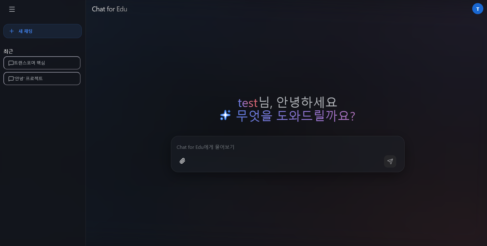
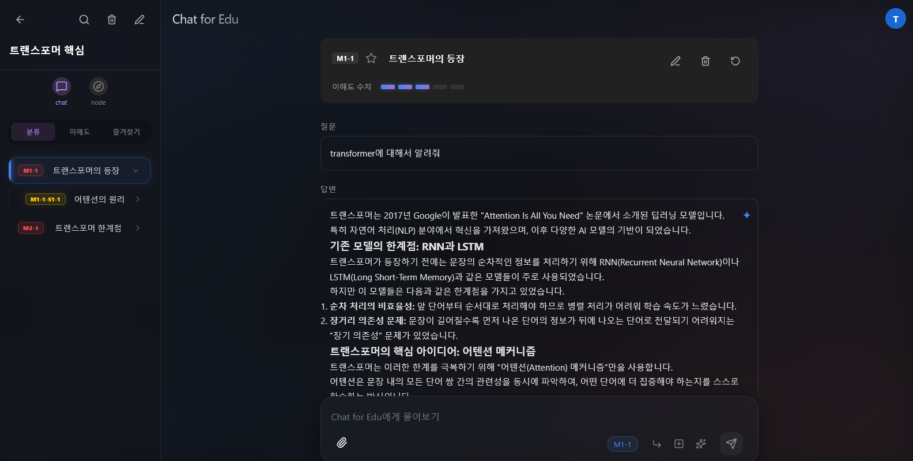
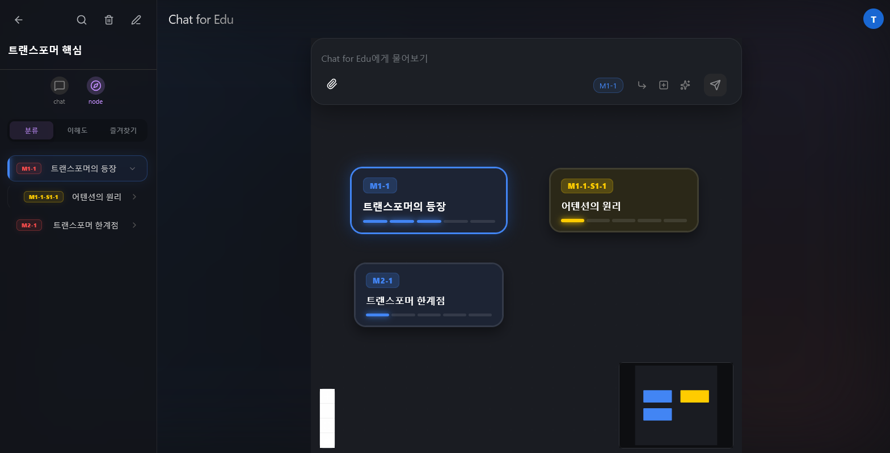

# Chat for Edu
- **Chat for Edu**는 학습 프로세스를 그래프로 가시화하여 학습 흐름을 명확히 보여주고, AI를 통해 질문하면서 학습 효율을 높이는 프로젝트입니다.

# 세부 기능
## 메인 주제 기반 학습 프로세스 관리

## 다양한 AI 질문-응답 채팅 관리

## 채팅 노드 그래프 (WIP)

# 작업환경 세팅
- [설치 가이드](./docs/install_guide.md)

