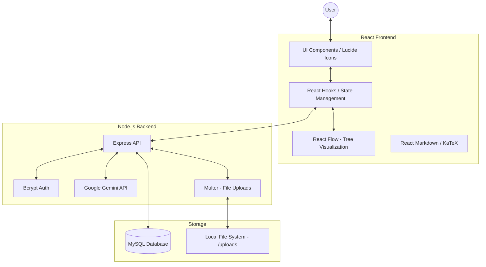
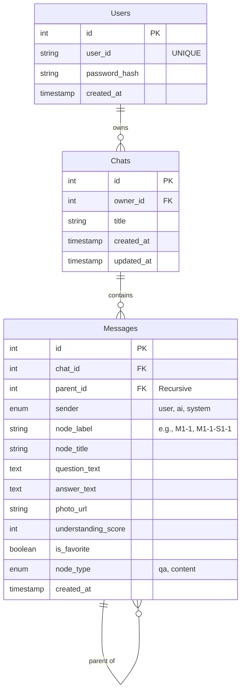

# Project Analysis: Chat for Edu

This document provides a comprehensive overview of the "Chat for Edu" project architecture, API specifications, and database structure.

## 1. Overall Architecture

The project is a full-stack web application designed for educational purposes, allowing users to interact with an AI (Google Gemini) in a structured, hierarchical "node-based" chat format.

### Key Technologies:
- **Frontend**: React, Vite, React Flow (for tree view), Lucide React (icons), React Markdown, Remark Math/Rehype Katex (for formulas).
- **Backend**: Node.js, Express, MySQL (using `mysql2/promise`), Multer (image uploads), Bcryptjs (password hashing).
- **AI**: Google Generative AI (Gemini 2.5 Flash).

---

## 2. API Specification

### Authentication
| Method | Endpoint | Description |
| :--- | :--- | :--- |
| `POST` | `/api/auth/register` | Register a new user with ID and password. |
| `POST` | `/api/auth/login` | Authenticate user and return user object. |
| `DELETE` | `/api/auth/user/:id` | Delete user account and associated data. |

### Chat Projects
| Method | Endpoint | Description |
| :--- | :--- | :--- |
| `GET` | `/api/chats/:userId` | Retrieve all chat projects for a specific user. |
| `POST` | `/api/chats` | Create a new chat project (supports text + image). Generates title via Gemini. |
| `PATCH` | `/api/chats/:id` | Update chat project title. |
| `DELETE` | `/api/chats/:chatId` | Delete an entire chat project. |

### Nodes (Messages)
| Method | Endpoint | Description |
| :--- | :--- | :--- |
| `GET` | `/api/chats/:chatId/nodes` | Get all nodes (messages) within a specific chat. |
| `POST` | `/api/nodes` | Create a new node (child of another node or top-level). |
| `PATCH` | `/api/nodes/:nodeId` | Update node metadata (title, understanding score, favorite). |
| `PUT` | `/api/messages/:id/regenerate` | Regenerate the AI answer for a specific node. |
| `DELETE` | `/api/nodes/:nodeId` | Delete a node. Triggers recursive deletion of children and automatic re-labeling of siblings. |

---

## 3. Database Schema

The database consists of three main tables: `Users`, `Chats`, and `Messages`.

### Key Data Patterns:
1.  **Hierarchical Structure**: The `Messages` table uses `parent_id` to create a tree structure. The `node_label` field (e.g., `M1-1`, `M1-1-S1-1`) represents the logical path in this hierarchy.
2.  **Multimodal Support**: `photo_url` in the `Messages` table stores the path to images uploaded via Multer, which are then sent to Gemini for context.
3.  **Automatic Re-labeling**: When a node is deleted, the backend logic in `server.js` re-calculates the `node_label` for remaining siblings to maintain numerical sequence.
